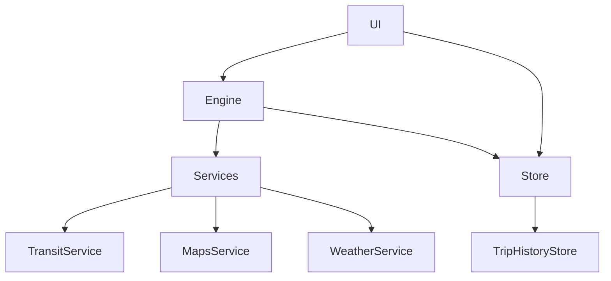

# Leave Now? iOS App

If I leave right now, what’s the best way to get to my destination?

## Platforms
- iOS 17+ (SwiftUI, Combine, async/await)

## Architecture

## Setup
1. Create `App/Support/Secrets.plist` by copying `App/Support/Secrets.plist.example` and adding your keys.
2. Open the Xcode project (to be generated) and set the bundle identifiers and Signing.
3. Run on iOS 17+.

## Keys
- `TFL_APP_ID`, `TFL_APP_KEY`
- `OPENWEATHER_API_KEY`

## CI
See `.github/workflows/ci.yml`.

## Screenshots
TBD (demo GIF using mocked data).

## Limitations
- No keys in repo. No PII sent off-device. Local-only storage.

## Getting Keys
- Create a TfL developer app to obtain `TFL_APP_ID` and `TFL_APP_KEY`.
- Create an OpenWeather account to obtain `OPENWEATHER_API_KEY`.

## Provide Secrets
- Copy `App/Support/Secrets.plist.example` to `App/Support/Secrets.plist`.
- Fill in your keys. The app reads at runtime via `Secrets`.

## Acceptance Tests (Engine)
- Prefer lower P50 when spreads similar.
- Prefer lower variance when P50 within 2 minutes.
- Rain increases walking penalty (≥ +1m on 20m walk @ default k_rain).
- Low confidence when (P90−P50)/P50 ≥ 0.25.
- Ignore disruptions not intersecting leg lines/stations.

## Demo
- The default build uses a mocked backtest harness to produce a deterministic demo in the UI.
